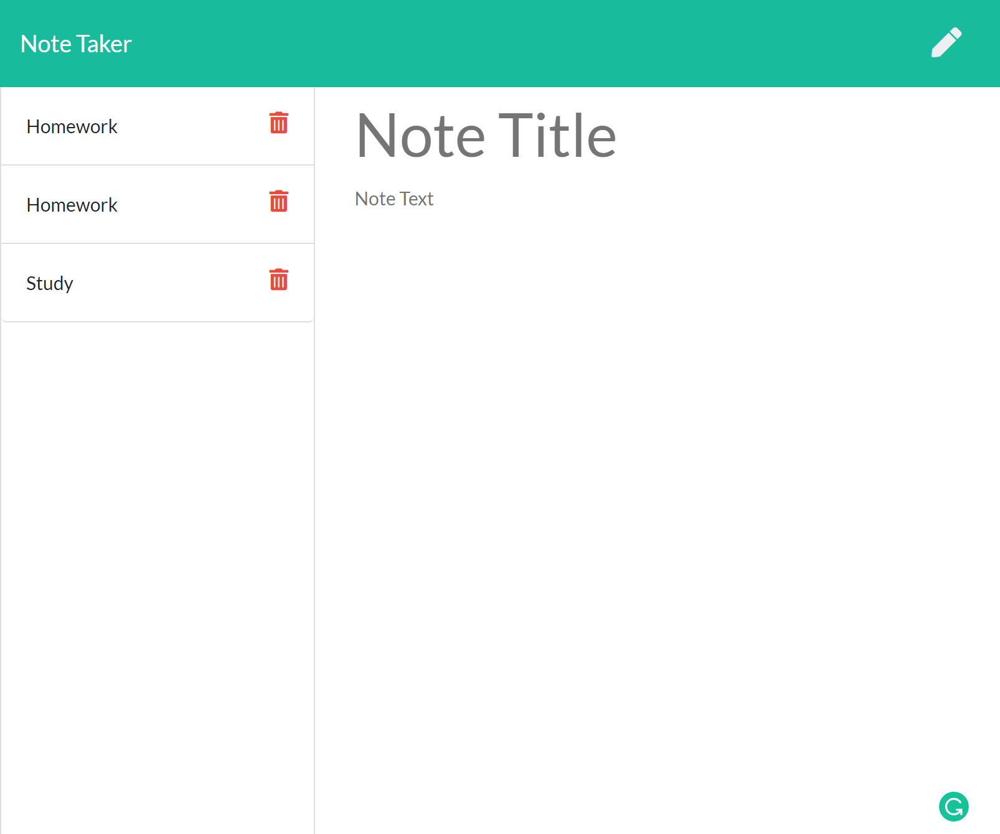
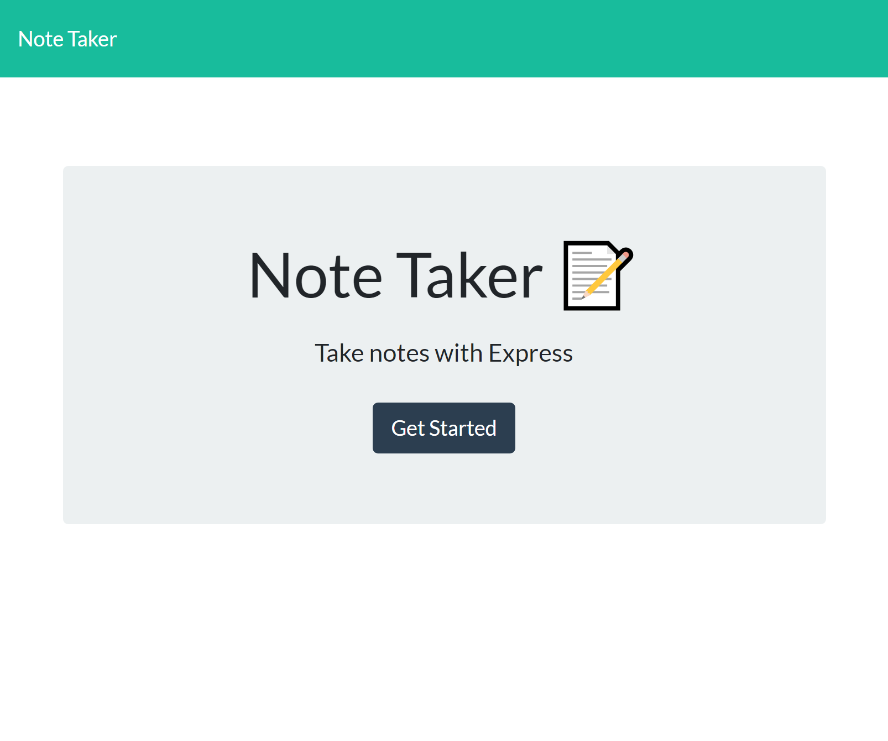

# Note-Taker

## Screenshots

## Mock-Up
[Video](https://drive.google.com/file/d/1oQLs3-e0oCmV35OC7y3imaX0qEEtGZ6Z/view?usp=sharing)
    
    # Table of Content: 
    *[Description](#description)
    *[Installation](#installation)
    *[Usage](#usage)
    *[License](#license)
    *[Contribution Guidelines](#contribution)
    *[Test](#test)
    *[Questions](#question)
    
## Description: 
Create an application called Note Taker that can be used to write and save notes.  This application will use an Express.js back end and will save and retrieve note data from a JSON file.

## Installation: 
npm express, fs, uuid and util.

## Usage: 
A small business owner want to write and save notes. So that they can organize their thoughts and keep track of tasks they need to complete.

## License: MIT

## Contribution: 
Pull requests are welcome.  For major changes, please open an issue first to discuss what you would like to change.

    
## Questions:

For any questions about my Team Profile Generator you can go to my Github page at the following link:

     
For additional questions please reach out to my email: tierragore@yahoo.com

